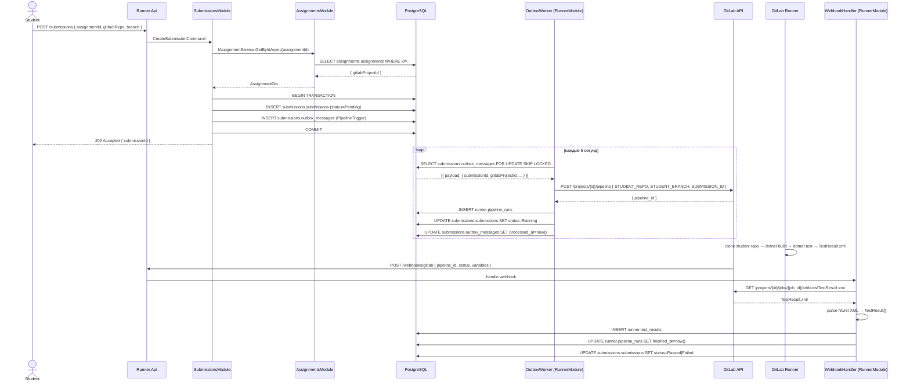

# Архитектура: Раннер автопроверки .NET-заданий (Modular Monolith)

Один ASP.NET Core 9 процесс, разбитый на 5 изолированных модулей с чёткими границами. Взаимодействие между модулями — через публичные DI-интерфейсы (синхронно) и Outbox + BackgroundService (асинхронно). Одна PostgreSQL с отдельными схемами на каждый модуль. Деплой — Docker Compose из двух контейнеров.

---

## 1. Почему Modular Monolith, а не микросервисы

| | Микросервисы | Modular Monolith |
|---|---|---|
| Деплой | 9 контейнеров, health-check цепочки | 2 контейнера (api + postgres) |
| Latency между модулями | HTTP round-trip (1–5 мс) | In-process вызов (нс) |
| Distributed tracing | Обязателен (Jaeger/Zipkin) | Не нужен |
| Транзакции | Saga / eventual consistency | Обычная EF Core транзакция |
| Операционная сложность | Высокая | Низкая |
| Независимый деплой модулей | Да | Нет |
| Масштабирование по модулям | Да | Нет (масштабируется весь процесс) |

**Вывод:** при академическом масштабе (десятки–сотни студентов) и небольшой команде Modular Monolith даёт те же границы ответственности без операционного overhead. При необходимости любой модуль извлекается в отдельный сервис без переписывания бизнес-логики.

---

## 2. Структура решения

```
Runner.sln
  src/
    Runner.Api/                   ← точка входа, Program.cs, middleware, DI-регистрация
    Runner.SharedKernel/          ← базовые типы, публичные интерфейсы модулей
    Modules/
      Identity/
        Runner.Identity.Module/   ← Domain, Application, Infrastructure
      Assignments/
        Runner.Assignments.Module/
      Submissions/
        Runner.Submissions.Module/
      RunnerModule/
        Runner.Runner.Module/
  tests/
    Runner.Api.Tests/
    Runner.Modules.Tests/         ← интеграционные тесты модулей
  docker-compose.yml
  docker-compose.override.yml
  .env.example
```

Каждый модуль — отдельный `*.csproj`. Внутренняя структура:
```
Runner.Identity.Module/
  Domain/          ← сущности, value objects, enum'ы
  Application/     ← use cases, команды/запросы, интерфейсы
  Infrastructure/  ← EF Core DbContext, репозитории, GitHub OAuth клиент
  IdentityModule.cs ← метод расширения AddIdentityModule()
```

### Ссылки между проектами

```
Runner.Api
  └── Runner.SharedKernel
  └── Runner.Identity.Module
  └── Runner.Assignments.Module
  └── Runner.Submissions.Module
  └── Runner.Runner.Module

Runner.Identity.Module      → Runner.SharedKernel (только)
Runner.Assignments.Module   → Runner.SharedKernel (только)
Runner.Submissions.Module   → Runner.SharedKernel (только)
Runner.Runner.Module        → Runner.SharedKernel (только)
```

**Модули не ссылаются друг на друга** — только через интерфейсы из `SharedKernel`.

---

## 3. Список модулей

### SharedKernel (`Runner.SharedKernel`)

Публичные интерфейсы, которые модули предоставляют наружу и потребляют друг от друга:

```csharp
// Контракты — что один модуль может спросить у другого
public interface IAssignmentService
{
    Task<AssignmentDto?> GetByIdAsync(Guid id, CancellationToken ct);
}

public interface ICurrentUserService
{
    Guid UserId { get; }
    string Role { get; }      // "Admin" | "Student"
}

// Общие типы
public record AssignmentDto(Guid Id, string Title, long GitLabProjectId);
public record PipelineTriggerPayload(Guid SubmissionId, long GitLabProjectId,
                                     string StudentRepo, string StudentBranch);
```

### Identity (`Runner.Identity.Module`)

- GitHub OAuth → выдача JWT
- Управление `UserProfile` (githubLogin, githubId, role)
- Реализует: `ICurrentUserService`
- Регистрация: `services.AddIdentityModule(config)`

### Assignments (`Runner.Assignments.Module`)

- CRUD заданий (только `Admin`)
- Привязка `GitLabProjectId` к заданию
- Реализует: `IAssignmentService`
- Регистрация: `services.AddAssignmentsModule(config)`

### Submissions (`Runner.Submissions.Module`)

- Приём сабмитов от студентов
- Хранение истории с статусами (`Pending → Running → Passed/Failed/Error/Timeout`)
- Запись в таблицу `submissions.outbox_messages` (атомарно с `Submission`)
- Предоставляет HTTP endpoint `PATCH /internal/submissions/{id}/status` для `RunnerModule`
- Регистрация: `services.AddSubmissionsModule(config)`

### Runner (`Runner.Runner.Module`)

- `OutboxWorker : BackgroundService` — читает `submissions.outbox_messages`, вызывает GitLab Pipelines API
- Обработчик webhook `POST /webhooks/gitlab` — валидация токена, скачивание артефакта, парсинг NUnit XML
- Сохранение `PipelineRun` + `TestResult[]` в своей схеме
- Вызывает `ISubmissionStatusService` (из SharedKernel) для обновления статуса
- Регистрация: `services.AddRunnerModule(config)`

---

## 4. Границы модулей и их соблюдение

### Технические механизмы

**`internal` по умолчанию** — все классы внутри модуля помечены `internal`. Наружу торчат только:
- Метод `Add*Module()` в `*Module.cs`
- Реализации публичных интерфейсов из `SharedKernel` (через DI, без прямой ссылки на тип)

```csharp
// Runner.Assignments.Module — публичный фасад
public static class AssignmentsModule
{
    public static IServiceCollection AddAssignmentsModule(
        this IServiceCollection services, IConfiguration config)
    {
        services.AddDbContext<AssignmentsDbContext>(opt =>
            opt.UseNpgsql(config.GetConnectionString("Default")));

        services.AddScoped<IAssignmentService, AssignmentService>();
        // ... остальные internal-регистрации
        return services;
    }
}

// internal — никто снаружи не может напрямую использовать
internal class AssignmentService : IAssignmentService { ... }
internal class AssignmentsDbContext : DbContext { ... }
```

**Архитектурный анализатор в CI** — пакет `NetArchTest.Rules`:

```csharp
[Fact]
public void SubmissionsModule_ShouldNotReference_RunnerModule()
{
    var result = Types.InAssembly(typeof(SubmissionsModule).Assembly)
        .ShouldNot()
        .HaveDependencyOn("Runner.Runner.Module")
        .GetResult();

    result.IsSuccessful.Should().BeTrue();
}
```

### Разрешено

| Что | Как |
|---|---|
| Модуль A вызывает сервис модуля B | Через интерфейс из `SharedKernel`, внедрённый через DI |
| Модуль A читает данные модуля B | Только через публичный метод интерфейса |
| Общие типы DTO | В `SharedKernel` |

### Запрещено

| Что | Почему |
|---|---|
| Прямая ссылка `A.Module → B.Module` | Нарушение изоляции |
| `RunnerDbContext` из `RunnerModule` в `SubmissionsModule` | Нарушение database-per-module |
| `using Runner.Identity.Module.Infrastructure.*` в другом модуле | `internal` не позволит, но и концептуально неверно |

---

## 5. Взаимодействие между модулями

### Синхронное (через DI-интерфейсы)

Пример: `SubmissionsModule` проверяет существование задания при создании сабмита:

```csharp
// Runner.Submissions.Module/Application/CreateSubmissionHandler.cs
internal class CreateSubmissionHandler(
    IAssignmentService assignmentService,  // ← из SharedKernel, реализован в AssignmentsModule
    SubmissionsDbContext db)
{
    public async Task<Guid> HandleAsync(CreateSubmissionCommand cmd, CancellationToken ct)
    {
        var assignment = await assignmentService.GetByIdAsync(cmd.AssignmentId, ct)
            ?? throw new NotFoundException($"Assignment {cmd.AssignmentId} not found");

        var submission = new Submission(cmd.StudentId, assignment.Id, cmd.GitHubUrl, cmd.Branch);
        var outbox = OutboxMessage.Create(new PipelineTriggerPayload(
            submission.Id, assignment.GitLabProjectId, cmd.GitHubUrl, cmd.Branch));

        db.Submissions.Add(submission);
        db.OutboxMessages.Add(outbox);
        await db.SaveChangesAsync(ct);  // ← одна транзакция

        return submission.Id;
    }
}
```

### Асинхронное (Outbox + BackgroundService)

`OutboxWorker` живёт в `RunnerModule`, но читает таблицу `submissions.outbox_messages` через прямое подключение к той же PostgreSQL (допустимо — это тот же процесс и та же БД):

```csharp
// Runner.Runner.Module/Infrastructure/OutboxWorker.cs
internal class OutboxWorker(IServiceScopeFactory scopeFactory, ILogger<OutboxWorker> logger)
    : BackgroundService
{
    protected override async Task ExecuteAsync(CancellationToken stoppingToken)
    {
        while (!stoppingToken.IsCancellationRequested)
        {
            await ProcessBatchAsync(stoppingToken);
            await Task.Delay(TimeSpan.FromSeconds(5), stoppingToken);
        }
    }

    private async Task ProcessBatchAsync(CancellationToken ct)
    {
        await using var scope = scopeFactory.CreateAsyncScope();
        var db = scope.ServiceProvider.GetRequiredService<SubmissionsOutboxReader>();
        var gitlabClient = scope.ServiceProvider.GetRequiredService<IGitLabClient>();

        var messages = await db.DequeueAsync(batchSize: 10, ct);
        foreach (var msg in messages)
        {
            try
            {
                var payload = JsonSerializer.Deserialize<PipelineTriggerPayload>(msg.Payload)!;
                var pipelineId = await gitlabClient.TriggerPipelineAsync(payload, ct);
                await db.MarkProcessedAsync(msg.Id, ct);
            }
            catch (Exception ex)
            {
                await db.RecordErrorAsync(msg.Id, ex.Message, ct);
            }
        }
    }
}
```

**Почему не MediatR для Outbox?** In-process `INotification` не даёт гарантии at-least-once при сбое процесса. БД-таблица с polling — единственный надёжный вариант без внешнего брокера.

---

## 6. Схема БД

Одна PostgreSQL-база, четыре схемы — по одной на модуль.

### EF Core конфигурация

```csharp
// Runner.Identity.Module/Infrastructure/IdentityDbContext.cs
internal class IdentityDbContext(DbContextOptions<IdentityDbContext> options) : DbContext(options)
{
    public DbSet<UserProfile> Users => Set<UserProfile>();

    protected override void OnModelCreating(ModelBuilder mb)
    {
        mb.HasDefaultSchema("identity");   // ← всё в схеме identity
        mb.ApplyConfigurationsFromAssembly(typeof(IdentityDbContext).Assembly);
    }
}

// Аналогично для остальных:
// AssignmentsDbContext → HasDefaultSchema("assignments")
// SubmissionsDbContext → HasDefaultSchema("submissions")
// RunnerDbContext      → HasDefaultSchema("runner")
```

Миграции запускаются отдельно на каждый контекст:
```bash
dotnet ef migrations add Init \
  --project src/Modules/Identity/Runner.Identity.Module \
  --startup-project src/Runner.Api \
  --context IdentityDbContext

dotnet ef migrations add Init \
  --project src/Modules/Assignments/Runner.Assignments.Module \
  --startup-project src/Runner.Api \
  --context AssignmentsDbContext
# и т.д.
```

### Таблицы по схемам

**`identity` схема**
```sql
identity.users (id, github_id, login, email, role, created_at)
identity.refresh_tokens (id, user_id, token_hash, expires_at)
```

**`assignments` схема**
```sql
assignments.assignments (id, title, description, gitlab_project_id,
                          gitlab_project_url, created_by, created_at, is_active)
```

**`submissions` схема**
```sql
submissions.submissions (id, assignment_id, student_id, github_repo_url,
                          branch, status, submitted_at)
submissions.outbox_messages (id, type, payload, created_at,
                              processed_at, retry_count, error)
```

**`runner` схема**
```sql
runner.pipeline_runs (id, submission_id, gitlab_pipeline_id,
                       gitlab_project_id, started_at, finished_at, raw_nunit_xml)
runner.test_results (id, pipeline_run_id, group_name, passed, failed,
                      error_type, error_message, duration_ms)
```

---

## 7. Outbox внутри монолита

```
submissions.outbox_messages
        │
        │ SELECT ... FOR UPDATE SKIP LOCKED (каждые 5 сек)
        ▼
  OutboxWorker (BackgroundService в RunnerModule)
        │
        ├──► GitLab API: POST /projects/{id}/pipeline
        │         { STUDENT_REPO, STUDENT_BRANCH, SUBMISSION_ID }
        │
        ├──► runner.pipeline_runs: INSERT
        │
        └──► ISubmissionStatusService.UpdateAsync(id, Running)
                    │
                    └──► submissions.submissions: UPDATE status
```

SQL-запрос конкурентного чтения (безопасен при нескольких репликах приложения):
```sql
SELECT * FROM submissions.outbox_messages
WHERE processed_at IS NULL AND retry_count < 5
ORDER BY created_at
LIMIT 10
FOR UPDATE SKIP LOCKED;
```

---

## 8. Диаграмма последовательности



---

## 9. Структура репозитория

```
Runner.sln
├── src/
│   ├── Runner.Api/
│   │   ├── Program.cs              ← регистрация всех модулей
│   │   ├── Runner.Api.csproj
│   │   └── appsettings.json
│   │
│   ├── Runner.SharedKernel/
│   │   ├── Interfaces/
│   │   │   ├── IAssignmentService.cs
│   │   │   ├── ICurrentUserService.cs
│   │   │   └── ISubmissionStatusService.cs
│   │   ├── Dtos/
│   │   │   └── AssignmentDto.cs
│   │   ├── Payloads/
│   │   │   └── PipelineTriggerPayload.cs
│   │   └── Runner.SharedKernel.csproj
│   │
│   └── Modules/
│       ├── Identity/
│       │   └── Runner.Identity.Module/
│       │       ├── Domain/
│       │       ├── Application/
│       │       ├── Infrastructure/
│       │       │   ├── IdentityDbContext.cs
│       │       │   └── Migrations/
│       │       └── IdentityModule.cs     ← AddIdentityModule()
│       │
│       ├── Assignments/
│       │   └── Runner.Assignments.Module/
│       │       ├── Domain/
│       │       ├── Application/
│       │       ├── Infrastructure/
│       │       │   ├── AssignmentsDbContext.cs
│       │       │   └── Migrations/
│       │       └── AssignmentsModule.cs
│       │
│       ├── Submissions/
│       │   └── Runner.Submissions.Module/
│       │       ├── Domain/
│       │       ├── Application/
│       │       ├── Infrastructure/
│       │       │   ├── SubmissionsDbContext.cs
│       │       │   └── Migrations/
│       │       └── SubmissionsModule.cs
│       │
│       └── RunnerModule/
│           └── Runner.Runner.Module/
│               ├── Application/
│               ├── Infrastructure/
│               │   ├── RunnerDbContext.cs
│               │   ├── OutboxWorker.cs
│               │   ├── GitLabClient.cs
│               │   ├── NUnitParser.cs
│               │   └── Migrations/
│               └── RunnerModule.cs
│
├── tests/
│   ├── Runner.Architecture.Tests/  ← NetArchTest проверки границ
│   └── Runner.Integration.Tests/
│
├── docker-compose.yml
├── docker-compose.override.yml
└── .env.example
```

### `Program.cs` — регистрация модулей

```csharp
var builder = WebApplication.CreateBuilder(args);

builder.Services
    .AddSharedKernel()
    .AddIdentityModule(builder.Configuration)
    .AddAssignmentsModule(builder.Configuration)
    .AddSubmissionsModule(builder.Configuration)
    .AddRunnerModule(builder.Configuration);

builder.Services.AddAuthentication(JwtBearerDefaults.AuthenticationScheme)
    .AddJwtBearer(/* ... */);

var app = builder.Build();

app.UseAuthentication();
app.UseAuthorization();

app.MapIdentityEndpoints();
app.MapAssignmentsEndpoints();
app.MapSubmissionsEndpoints();
app.MapWebhookEndpoints();    // ← из RunnerModule

app.Run();
```

---

## 10. Docker Compose

```yaml
services:
  runner-api:
    build:
      context: .
      dockerfile: src/Runner.Api/Dockerfile
    ports:
      - "8080:8080"
    environment:
      - ASPNETCORE_ENVIRONMENT=Production
      - ConnectionStrings__Default=Host=postgres;Database=runner;Username=app;Password=${PG_PASS}
      - GitHub__ClientId=${GITHUB_CLIENT_ID}
      - GitHub__ClientSecret=${GITHUB_CLIENT_SECRET}
      - Jwt__Secret=${JWT_SECRET}
      - GitLab__Token=${GITLAB_TOKEN}
      - GitLab__WebhookSecret=${GITLAB_WEBHOOK_SECRET}
      - Outbox__PollingIntervalSeconds=5
    depends_on:
      postgres:
        condition: service_healthy
    networks: [internal]

  postgres:
    image: postgres:17-alpine
    environment:
      POSTGRES_DB: runner
      POSTGRES_USER: app
      POSTGRES_PASSWORD: ${PG_PASS}
    volumes:
      - pgdata:/var/lib/postgresql/data
    healthcheck:
      test: ["CMD-SHELL", "pg_isready -U app"]
      interval: 5s
      retries: 5
    networks: [internal]

networks:
  internal:
    driver: bridge

volumes:
  pgdata:
```

Итого: **2 контейнера** вместо 9.

---

## 11. Путь к микросервисам

Если в будущем потребуется независимый деплой или масштабирование отдельного модуля — каждый модуль уже готов к извлечению:

| Шаг | Что делать |
|---|---|
| 1. Выделить `*.csproj` | Переместить в отдельный репозиторий или `.sln`-проект, добавить `Program.cs` |
| 2. Заменить DI-вызов HTTP-клиентом | `IAssignmentService` → реализация через `HttpClient` вместо прямого вызова |
| 3. Заменить Outbox на брокер | `submissions.outbox_messages` polling → `IPublisher` с RabbitMQ/Kafka адаптером |
| 4. Разделить БД | Каждый модуль уже имеет свою схему и свой `DbContext` — вынести в отдельный инстанс PostgreSQL |
| 5. Добавить Gateway | YARP конфигурируется по тем же маршрутам, что уже определены в `Map*Endpoints()` |

Бизнес-логика (`Domain/`, `Application/`) не меняется — меняется только транспортный слой.

