# Инфографика и схемы системы Runner

> Все диаграммы выполнены в формате Mermaid.
> Для рендеринга используйте любой Mermaid-совместимый просмотрщик
> (GitHub, GitLab, плагины IDE, https://mermaid.live и др.).
>
> Нумерация рисунков соответствует ссылкам в файле `report.md`.

---

## Рисунок 1. Общая архитектура системы

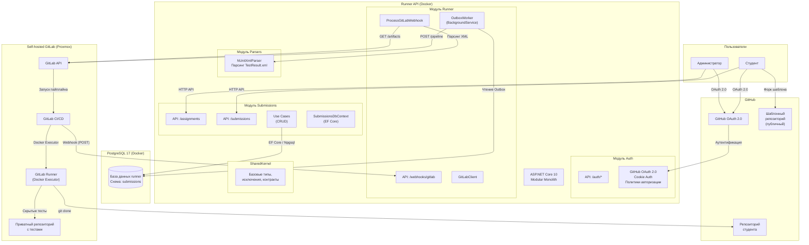

---

## Рисунок 2. Схема базы данных (ER-диаграмма)

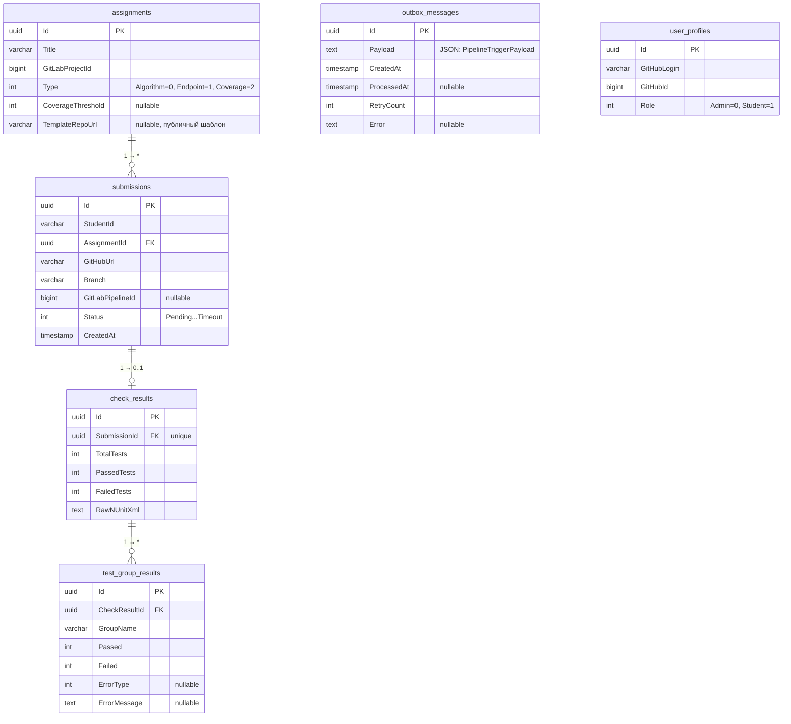

---

## Рисунок 3. Жизненный цикл отправки (Sequence Diagram)

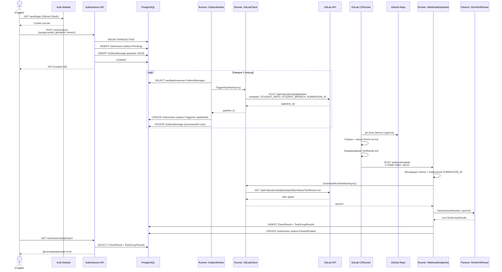

---

## Рисунок 4. Диаграмма состояний отправки (State Machine)

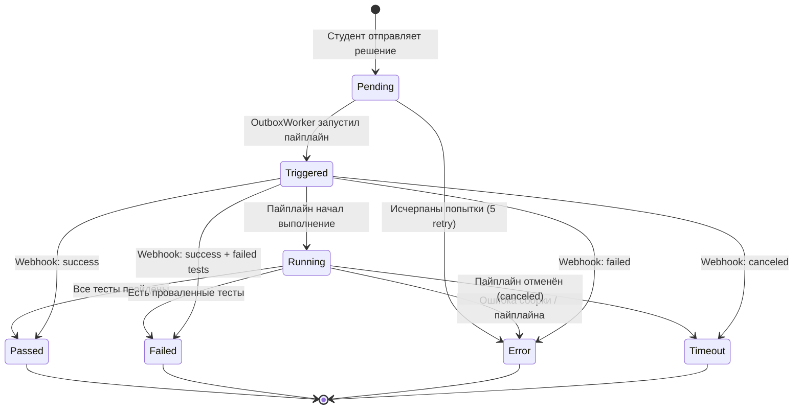

---

## Рисунок 5. Структура модулей (Modular Monolith)

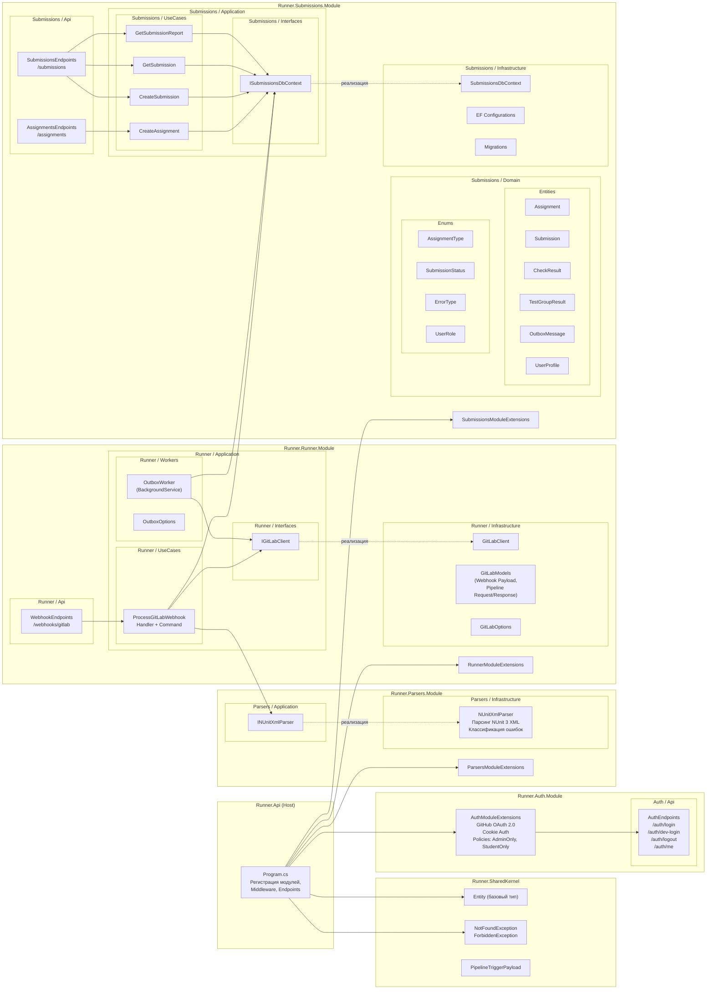

---

## Рисунок 6. Инфраструктура развёртывания (Docker Compose + Proxmox)

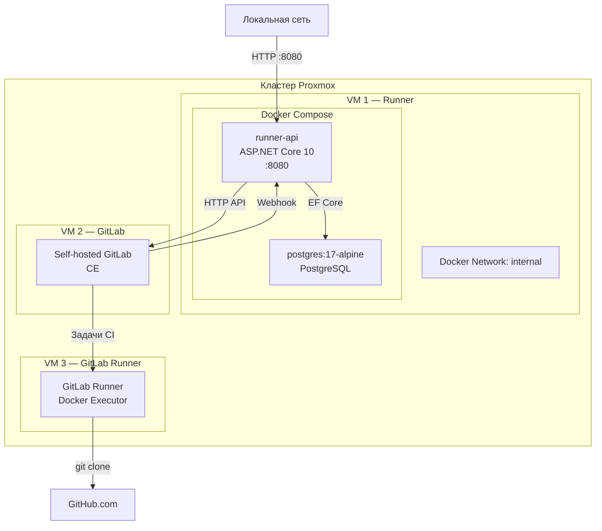

---

## Рисунок 7. Алгоритм классификации ошибок (Parsers Module)

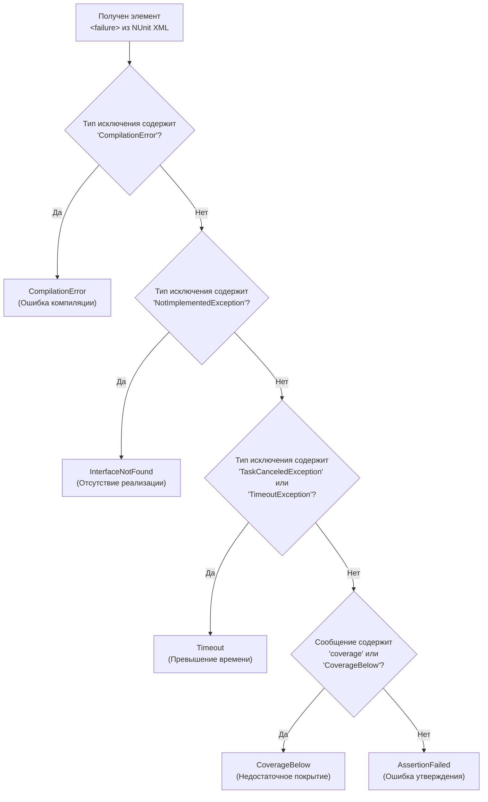

---

## Рисунок 8. Карта API-эндпоинтов

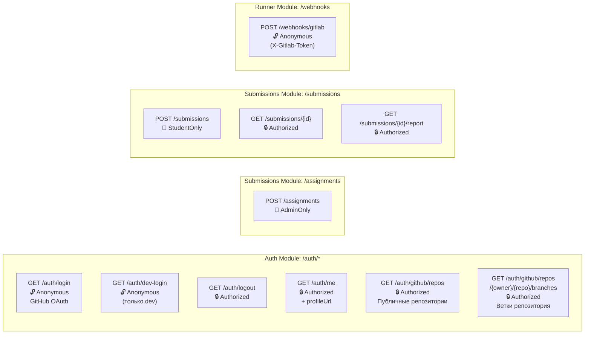

---

## Рисунок 9. Межмодульные зависимости

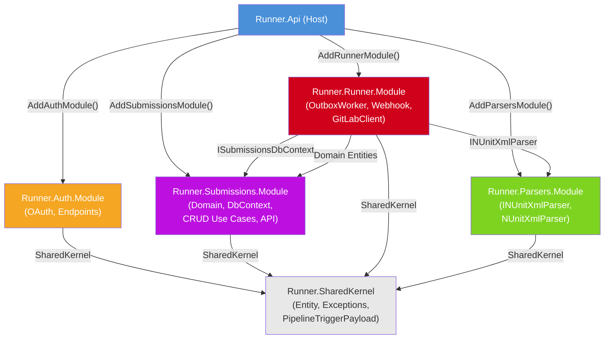

---

## Рисунок 10. Схема взаимодействия репозиториев (шаблонный и тестовый)

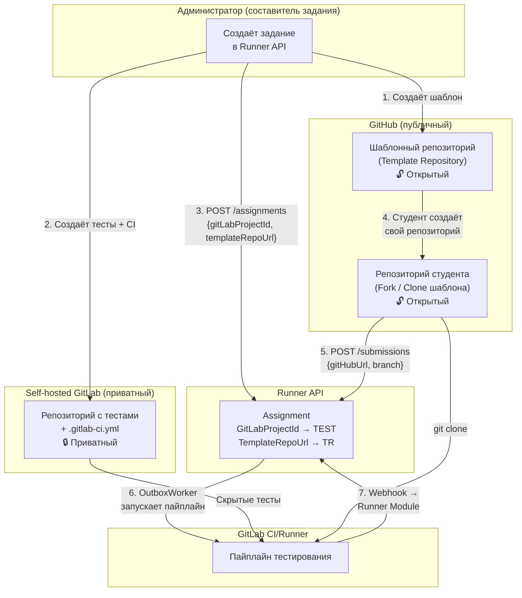

---

## Рисунок 11. Схема интеграции с платформой ProTech (планируемая)

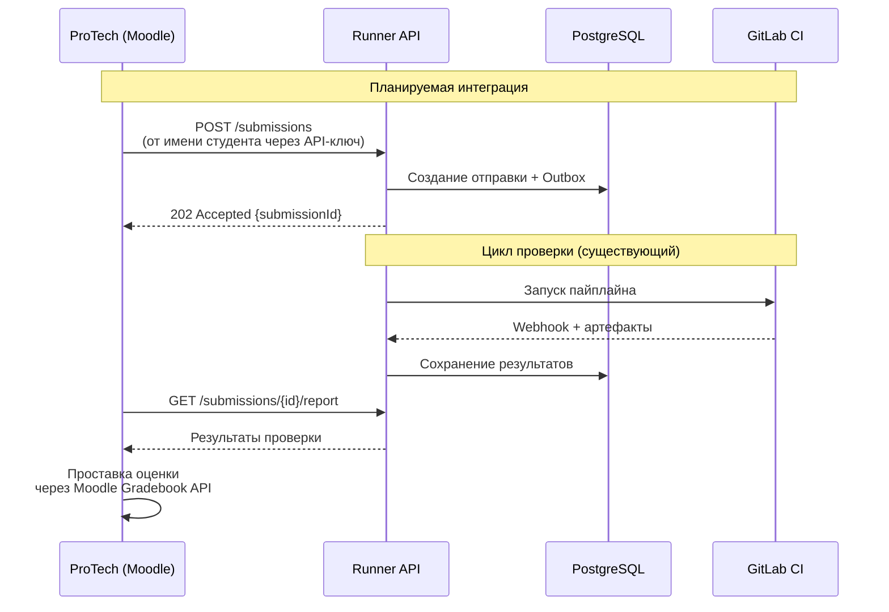
