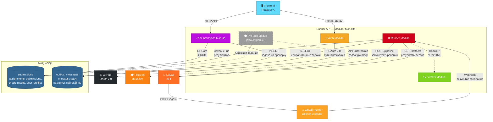

# Диаграмма для презентации

> Упрощённая схема архитектуры системы Runner для слайдов.

```mermaid
graph TB
    subgraph "Runner API — Modular Monolith"
        direction TB

        AUTH["🔐 Auth Module"]
        SUB["📋 Submissions Module"]
        RUN["⚙️ Runner Module"]
        PARSERS["🔍 Parsers Module"]
        PROTECH["🎓 ProTech Module<br/><i>(планируемый)</i>"]
    end

    subgraph "PostgreSQL"
        DB_SUB[("submissions<br/>assignments, submissions,<br/>check_results, user_profiles")]
        DB_OUT[("outbox_messages<br/>очередь задач<br/>на запуск пайплайнов")]
    end

    FE["🖥️ Frontend<br/>React SPA"]
    GH["🐙 GitHub<br/>OAuth 2.0"]
    GL["🦊 GitLab<br/>API"]
    GLR["🏃 GitLab Runner<br/>Docker Executor"]
    PT["🎓 ProTech<br/>(Moodle)"]

    %% Frontend → API
    FE -->|"HTTP API"| SUB
    FE -->|"Логин / Логаут"| AUTH

    %% Auth → GitHub
    AUTH -->|"OAuth 2.0<br/>аутентификация"| GH

    %% Submissions → DB
    SUB -->|"EF Core<br/>CRUD"| DB_SUB
    SUB -->|"INSERT<br/>задача на проверку"| DB_OUT

    %% Runner — Outbox → GitLab
    RUN -->|"SELECT<br/>необработанные задачи"| DB_OUT
    RUN -->|"POST /pipeline<br/>запуск тестирования"| GL
    RUN -->|"GET /artifacts<br/>результаты тестов"| GL
    RUN -->|"Сохранение<br/>результатов"| DB_SUB

    %% Parsers
    RUN -.->|"Парсинг<br/>NUnit XML"| PARSERS

    %% GitLab → GitLab Runner
    GL -->|"CI/CD задачи"| GLR
    GLR -->|"Webhook<br/>результат пайплайна"| RUN

    %% ProTech
    PROTECH -.->|"API-интеграция<br/><i>(планируется)</i>"| PT
    PROTECH -.->|"Оценки и задания"| DB_SUB

    style AUTH fill:#f5a623,color:#fff,stroke:#d4911e
    style SUB fill:#bd10e0,color:#fff,stroke:#9b0db8
    style RUN fill:#d0021b,color:#fff,stroke:#a80116
    style PARSERS fill:#7ed321,color:#fff,stroke:#65a91a
    style PROTECH fill:#9b9b9b,color:#fff,stroke:#7a7a7a,stroke-dasharray: 5 5
    style GH fill:#24292e,color:#fff,stroke:#1a1e22
    style GL fill:#fc6d26,color:#fff,stroke:#e05d1a
    style GLR fill:#fca326,color:#fff,stroke:#e08f1a
    style PT fill:#f98012,color:#fff,stroke:#d96d0e
    style DB_SUB fill:#336791,color:#fff,stroke:#2a5577
    style DB_OUT fill:#336791,color:#fff,stroke:#2a5577
    style FE fill:#61dafb,color:#333,stroke:#4fa8c5
```

